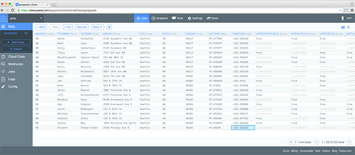

PNA
=============================================

###Description

A responsive mobile app for the Phinney Neighborhood Association (PNA).

###Technology Stack
* __Angular JS__ - MVC(ish) goodness
* __Angular Material__ - Responsive/mobile goodness
* __Jasmine__ - Testing Framework
* __Karma__ - Unit Testing
* __Protractor__ - End-to-End Testing

###Prerequisites for Developing

__Step 1__.  Install [Node](http://nodejs.org) if you don't have it.

__Step 2__.  Install [Bower](http://bower.io) if you don't have it.

	$ npm install -g bower
	
__Step 3__.  Install [Protractor](http://angular.github.io/protractor/#/) if you don't have it.
	
	$ npm install -g protractor
	
	$ webdriver-manager update

###Running the App

__Step 1__. Clone the repo then cd into the project root.
 
__Step 2__. To add the [Angular JS](https://angularjs.org) library and the [Angular-Material](https://material.angularjs.org/#/) native directives to your project simply execute ...

	$ bower install
	
	//see bower.json file for details
	
__Step 3__. To add the [Karma Test Runner](http://karma-runner.github.io/0.12/intro/installation.html) and the [Jasmine Testing Framework](http://jasmine.github.io) to  your project simply execute ...

	$ npm install

	//see package.json file for details

###Running Unit Tests
    
Unit test suites are in __test/unit/__...

In Terminal, run the unit tests by executing ...

	./node_modules/karma/bin/karma start

Alternatively, if you use Webstorm, right-click karma.conf.js and choose __Run 'karma.conf.js__'


###Running End-to-End Tests

End-to-End test suites are in __test/e2e/__...

Before running, first open test/protractor.conf.js and change the 'baseUrl' parameter to be the Url of your app.  

Note, this can be __localhost:port__ when dev-ing on your machine.  It can also be a remote test or production server - so you can continue running your end-to-end test suites as it is moved between different servers.

````
exports.config = {

    ...
    baseUrl:'http://host:port/some.html' //<---CHANGE ME HERE
};
````

Dedicate a new Terminal window to run the Selenium Server (note, you get this for free with installing Protractor!) by executing ...

	webdriver-manager start
	
In the Terminal (pointing in your project directory), run your end-to-end tests by executing ...

	cd test
	
	protractor protractor.conf.js


###PNA Client Workflow

Below is a description of the workflow the client must complete every year to update the content of the PNA mobile app.

__Step 1. Login to Parse__

* If you do not have a Parse account, create a free account [here](https://www.parse.com/#signup).  

* Send SpatialDev the e-mail you used to create your Parse Account.  

* SpatialDev will then add you to the 'PNA' project as a collaborator allowing you the ability to create, edit, and maintain the data consumed by the mobile app.

__Step 2.  Create, Update, Delete, sale locations__

* Go to the __Core__ tab.  

* In the left panel, click on the __garagesale__ link.  This will present a 'online spreadsheet' of the garage sale data (its actually a custom UI on top of MongoDB).

* Create a new Row by clicking the '+ Row' button on the top.  Double-click into each cell to create or update a value.



__Step 3.  View your data in the Mobile App__

View the mobile app on your phone so that you can confirm how the new data looks in the mobile app.  Continue creating new records or updating records as needed.